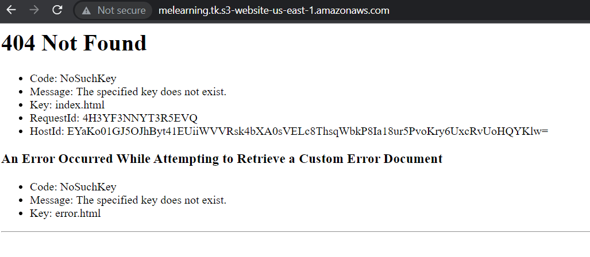

# Create S3 bucket for website using terraform

### Create `.env` file

```ini
AWS_ACCESS_KEY_ID="xxxxxxxxxxxxx"
AWS_SECRET_ACCESS_KEY="xxxxxxxxxxxxxxxxxxxxxxxxxxx"
AWS_REGION="us-east-1"
```

### Create main.tf
```ruby
terraform {
  required_providers {
    aws = {
      source  = "hashicorp/aws"
      version = "4.31.0"
    }
  }
}

provider "aws" {
  default_tags {
    tags = {
      use                  = "useast1_FirstProject"
      useast1_FirstProject = "use"
    }
  }
}

variable "domain_name" {
  description = "The name of the domain for our website."
  default = "melearning.tk"
}

data "aws_iam_policy_document" "bucket_policy" {
  statement {
    sid = "PublicReadGetObject"
    effect = "Allow"
    actions = [ "s3:GetObject" ]
    principals {
      type = "*"
      identifiers = [ "*" ]
    }
    resources = [ "arn:aws:s3:::${var.domain_name}/*" ]
  }
}

resource "aws_s3_bucket" "website" {
  bucket = var.domain_name          
}

resource "aws_s3_bucket_policy" "website" {
  bucket = aws_s3_bucket.website.id
  policy = data.aws_iam_policy_document.bucket_policy.json
}  

resource "aws_s3_bucket_acl" "website" {
  bucket = aws_s3_bucket.website.id
  acl    = "public-read"
}

resource "aws_s3_bucket_website_configuration" "website" {
  bucket = aws_s3_bucket.website.bucket

  index_document {
    suffix = "index.html"
  }

  error_document {
    key = "error.html"
  }
}

output "website_bucket_url" {
  value = aws_s3_bucket_website_configuration.website.website_endpoint
}
```

### Run terraform commands

Initialize terraform

It will download provider and install it

```bash
buntu@desktop:~/Desktop/ex_files/work$ docker-compose run --rm terraform init
Creating work_terraform_run ... done

Initializing the backend...

Initializing provider plugins...
- Reusing previous version of hashicorp/aws from the dependency lock file
- Using previously-installed hashicorp/aws v4.31.0

Terraform has been successfully initialized!

You may now begin working with Terraform. Try running "terraform plan" to see
any changes that are required for your infrastructure. All Terraform commands
should now work.

If you ever set or change modules or backend configuration for Terraform,
rerun this command to reinitialize your working directory. If you forget, other
commands will detect it and remind you to do so if necessary.
```
<br>
<br>
Prepare Plan : `docker-compose run --rm terraform plan`
<details>
  <summary>Full Output</summary>

```bash
ubuntu@desktop:~/Desktop/ex_files/work$ docker-compose run --rm terraform plan
Creating work_terraform_run ... done
data.aws_iam_policy_document.bucket_policy: Reading...
data.aws_iam_policy_document.bucket_policy: Read complete after 0s [id=715928839]

Terraform used the selected providers to generate the following execution plan. Resource actions are indicated with the following symbols:
  + create

Terraform will perform the following actions:

  # aws_s3_bucket.website will be created
  + resource "aws_s3_bucket" "website" {
      + acceleration_status         = (known after apply)
      + acl                         = (known after apply)
      + arn                         = (known after apply)
      + bucket                      = "melearning.tk"
      + bucket_domain_name          = (known after apply)
      + bucket_regional_domain_name = (known after apply)
      + force_destroy               = false
      + hosted_zone_id              = (known after apply)
      + id                          = (known after apply)
      + object_lock_enabled         = (known after apply)
      + policy                      = (known after apply)
      + region                      = (known after apply)
      + request_payer               = (known after apply)
      + tags_all                    = {
          + "use"                  = "useast1_FirstProject"
          + "useast1_FirstProject" = "use"
        }
      + website_domain              = (known after apply)
      + website_endpoint            = (known after apply)

      + cors_rule {
          + allowed_headers = (known after apply)
          + allowed_methods = (known after apply)
          + allowed_origins = (known after apply)
          + expose_headers  = (known after apply)
          + max_age_seconds = (known after apply)
        }

      + grant {
          + id          = (known after apply)
          + permissions = (known after apply)
          + type        = (known after apply)
          + uri         = (known after apply)
        }

      + lifecycle_rule {
          + abort_incomplete_multipart_upload_days = (known after apply)
          + enabled                                = (known after apply)
          + id                                     = (known after apply)
          + prefix                                 = (known after apply)
          + tags                                   = (known after apply)

          + expiration {
              + date                         = (known after apply)
              + days                         = (known after apply)
              + expired_object_delete_marker = (known after apply)
            }

          + noncurrent_version_expiration {
              + days = (known after apply)
            }

          + noncurrent_version_transition {
              + days          = (known after apply)
              + storage_class = (known after apply)
            }

          + transition {
              + date          = (known after apply)
              + days          = (known after apply)
              + storage_class = (known after apply)
            }
        }

      + logging {
          + target_bucket = (known after apply)
          + target_prefix = (known after apply)
        }

      + object_lock_configuration {
          + object_lock_enabled = (known after apply)

          + rule {
              + default_retention {
                  + days  = (known after apply)
                  + mode  = (known after apply)
                  + years = (known after apply)
                }
            }
        }

      + replication_configuration {
          + role = (known after apply)

          + rules {
              + delete_marker_replication_status = (known after apply)
              + id                               = (known after apply)
              + prefix                           = (known after apply)
              + priority                         = (known after apply)
              + status                           = (known after apply)

              + destination {
                  + account_id         = (known after apply)
                  + bucket             = (known after apply)
                  + replica_kms_key_id = (known after apply)
                  + storage_class      = (known after apply)

                  + access_control_translation {
                      + owner = (known after apply)
                    }

                  + metrics {
                      + minutes = (known after apply)
                      + status  = (known after apply)
                    }

                  + replication_time {
                      + minutes = (known after apply)
                      + status  = (known after apply)
                    }
                }

              + filter {
                  + prefix = (known after apply)
                  + tags   = (known after apply)
                }

              + source_selection_criteria {
                  + sse_kms_encrypted_objects {
                      + enabled = (known after apply)
                    }
                }
            }
        }

      + server_side_encryption_configuration {
          + rule {
              + bucket_key_enabled = (known after apply)

              + apply_server_side_encryption_by_default {
                  + kms_master_key_id = (known after apply)
                  + sse_algorithm     = (known after apply)
                }
            }
        }

      + versioning {
          + enabled    = (known after apply)
          + mfa_delete = (known after apply)
        }

      + website {
          + error_document           = (known after apply)
          + index_document           = (known after apply)
          + redirect_all_requests_to = (known after apply)
          + routing_rules            = (known after apply)
        }
    }

  # aws_s3_bucket_acl.website will be created
  + resource "aws_s3_bucket_acl" "website" {
      + acl    = "public-read"
      + bucket = (known after apply)
      + id     = (known after apply)

      + access_control_policy {
          + grant {
              + permission = (known after apply)

              + grantee {
                  + display_name  = (known after apply)
                  + email_address = (known after apply)
                  + id            = (known after apply)
                  + type          = (known after apply)
                  + uri           = (known after apply)
                }
            }

          + owner {
              + display_name = (known after apply)
              + id           = (known after apply)
            }
        }
    }

  # aws_s3_bucket_policy.website will be created
  + resource "aws_s3_bucket_policy" "website" {
      + bucket = (known after apply)
      + id     = (known after apply)
      + policy = jsonencode(
            {
              + Statement = [
                  + {
                      + Action    = "s3:GetObject"
                      + Effect    = "Allow"
                      + Principal = "*"
                      + Resource  = "arn:aws:s3:::melearning.tk/*"
                      + Sid       = "PublicReadGetObject"
                    },
                ]
              + Version   = "2012-10-17"
            }
        )
    }

  # aws_s3_bucket_website_configuration.website will be created
  + resource "aws_s3_bucket_website_configuration" "website" {
      + bucket           = "melearning.tk"
      + id               = (known after apply)
      + routing_rules    = (known after apply)
      + website_domain   = (known after apply)
      + website_endpoint = (known after apply)

      + error_document {
          + key = "error.html"
        }

      + index_document {
          + suffix = "index.html"
        }

      + routing_rule {
          + condition {
              + http_error_code_returned_equals = (known after apply)
              + key_prefix_equals               = (known after apply)
            }

          + redirect {
              + host_name               = (known after apply)
              + http_redirect_code      = (known after apply)
              + protocol                = (known after apply)
              + replace_key_prefix_with = (known after apply)
              + replace_key_with        = (known after apply)
            }
        }
    }

Plan: 4 to add, 0 to change, 0 to destroy.

Changes to Outputs:
  + website_bucket_url = (known after apply)

─────────────────────────────────────────────────────────────────────────────────────────────────────────────────────────────────────────────

Note: You didn't use the -out option to save this plan, so Terraform can't guarantee to take exactly these actions if you run "terraform
apply" now.

```

</details>
<br>
<br>

Apply Configuration `docker-compose run --rm terraform apply`

<details>
  <summary>Full Output</summary>

```bash
ubuntu@desktop:~/Desktop/ex_files/work$ docker-compose run --rm terraform apply
Creating work_terraform_run ... done
data.aws_iam_policy_document.bucket_policy: Reading...
data.aws_iam_policy_document.bucket_policy: Read complete after 0s [id=715928839]

Terraform used the selected providers to generate the following execution plan. Resource actions are indicated with the following symbols:
  + create

Terraform will perform the following actions:

  # aws_s3_bucket.website will be created
  + resource "aws_s3_bucket" "website" {
      + acceleration_status         = (known after apply)
      + acl                         = (known after apply)
      + arn                         = (known after apply)
      + bucket                      = "melearning.tk"
      + bucket_domain_name          = (known after apply)
      + bucket_regional_domain_name = (known after apply)
      + force_destroy               = false
      + hosted_zone_id              = (known after apply)
      + id                          = (known after apply)
      + object_lock_enabled         = (known after apply)
      + policy                      = (known after apply)
      + region                      = (known after apply)
      + request_payer               = (known after apply)
      + tags_all                    = {
          + "use"                  = "useast1_FirstProject"
          + "useast1_FirstProject" = "use"
        }
      + website_domain              = (known after apply)
      + website_endpoint            = (known after apply)

      + cors_rule {
          + allowed_headers = (known after apply)
          + allowed_methods = (known after apply)
          + allowed_origins = (known after apply)
          + expose_headers  = (known after apply)
          + max_age_seconds = (known after apply)
        }

      + grant {
          + id          = (known after apply)
          + permissions = (known after apply)
          + type        = (known after apply)
          + uri         = (known after apply)
        }

      + lifecycle_rule {
          + abort_incomplete_multipart_upload_days = (known after apply)
          + enabled                                = (known after apply)
          + id                                     = (known after apply)
          + prefix                                 = (known after apply)
          + tags                                   = (known after apply)

          + expiration {
              + date                         = (known after apply)
              + days                         = (known after apply)
              + expired_object_delete_marker = (known after apply)
            }

          + noncurrent_version_expiration {
              + days = (known after apply)
            }

          + noncurrent_version_transition {
              + days          = (known after apply)
              + storage_class = (known after apply)
            }

          + transition {
              + date          = (known after apply)
              + days          = (known after apply)
              + storage_class = (known after apply)
            }
        }

      + logging {
          + target_bucket = (known after apply)
          + target_prefix = (known after apply)
        }

      + object_lock_configuration {
          + object_lock_enabled = (known after apply)

          + rule {
              + default_retention {
                  + days  = (known after apply)
                  + mode  = (known after apply)
                  + years = (known after apply)
                }
            }
        }

      + replication_configuration {
          + role = (known after apply)

          + rules {
              + delete_marker_replication_status = (known after apply)
              + id                               = (known after apply)
              + prefix                           = (known after apply)
              + priority                         = (known after apply)
              + status                           = (known after apply)

              + destination {
                  + account_id         = (known after apply)
                  + bucket             = (known after apply)
                  + replica_kms_key_id = (known after apply)
                  + storage_class      = (known after apply)

                  + access_control_translation {
                      + owner = (known after apply)
                    }

                  + metrics {
                      + minutes = (known after apply)
                      + status  = (known after apply)
                    }

                  + replication_time {
                      + minutes = (known after apply)
                      + status  = (known after apply)
                    }
                }

              + filter {
                  + prefix = (known after apply)
                  + tags   = (known after apply)
                }

              + source_selection_criteria {
                  + sse_kms_encrypted_objects {
                      + enabled = (known after apply)
                    }
                }
            }
        }

      + server_side_encryption_configuration {
          + rule {
              + bucket_key_enabled = (known after apply)

              + apply_server_side_encryption_by_default {
                  + kms_master_key_id = (known after apply)
                  + sse_algorithm     = (known after apply)
                }
            }
        }

      + versioning {
          + enabled    = (known after apply)
          + mfa_delete = (known after apply)
        }

      + website {
          + error_document           = (known after apply)
          + index_document           = (known after apply)
          + redirect_all_requests_to = (known after apply)
          + routing_rules            = (known after apply)
        }
    }

  # aws_s3_bucket_acl.website will be created
  + resource "aws_s3_bucket_acl" "website" {
      + acl    = "public-read"
      + bucket = (known after apply)
      + id     = (known after apply)

      + access_control_policy {
          + grant {
              + permission = (known after apply)

              + grantee {
                  + display_name  = (known after apply)
                  + email_address = (known after apply)
                  + id            = (known after apply)
                  + type          = (known after apply)
                  + uri           = (known after apply)
                }
            }

          + owner {
              + display_name = (known after apply)
              + id           = (known after apply)
            }
        }
    }

  # aws_s3_bucket_policy.website will be created
  + resource "aws_s3_bucket_policy" "website" {
      + bucket = (known after apply)
      + id     = (known after apply)
      + policy = jsonencode(
            {
              + Statement = [
                  + {
                      + Action    = "s3:GetObject"
                      + Effect    = "Allow"
                      + Principal = "*"
                      + Resource  = "arn:aws:s3:::melearning.tk/*"
                      + Sid       = "PublicReadGetObject"
                    },
                ]
              + Version   = "2012-10-17"
            }
        )
    }

  # aws_s3_bucket_website_configuration.website will be created
  + resource "aws_s3_bucket_website_configuration" "website" {
      + bucket           = "melearning.tk"
      + id               = (known after apply)
      + routing_rules    = (known after apply)
      + website_domain   = (known after apply)
      + website_endpoint = (known after apply)

      + error_document {
          + key = "error.html"
        }

      + index_document {
          + suffix = "index.html"
        }

      + routing_rule {
          + condition {
              + http_error_code_returned_equals = (known after apply)
              + key_prefix_equals               = (known after apply)
            }

          + redirect {
              + host_name               = (known after apply)
              + http_redirect_code      = (known after apply)
              + protocol                = (known after apply)
              + replace_key_prefix_with = (known after apply)
              + replace_key_with        = (known after apply)
            }
        }
    }

Plan: 4 to add, 0 to change, 0 to destroy.

Changes to Outputs:
  + website_bucket_url = (known after apply)

Do you want to perform these actions?
  Terraform will perform the actions described above.
  Only 'yes' will be accepted to approve.

  Enter a value: yes

aws_s3_bucket.website: Creating...
aws_s3_bucket.website: Creation complete after 6s [id=melearning.tk]
aws_s3_bucket_website_configuration.website: Creating...
aws_s3_bucket_policy.website: Creating...
aws_s3_bucket_acl.website: Creating...
aws_s3_bucket_policy.website: Creation complete after 0s [id=melearning.tk]
aws_s3_bucket_acl.website: Creation complete after 1s [id=melearning.tk,public-read]
aws_s3_bucket_website_configuration.website: Creation complete after 1s [id=melearning.tk]

Apply complete! Resources: 4 added, 0 changed, 0 destroyed.

Outputs:

website_bucket_url = "melearning.tk.s3-website-us-east-1.amazonaws.com"
ubuntu@desktop:~/Desktop/ex_files/work$ 

```
</details>

Visit the website provided at the last line.
It will show you the 404 error document as shown

